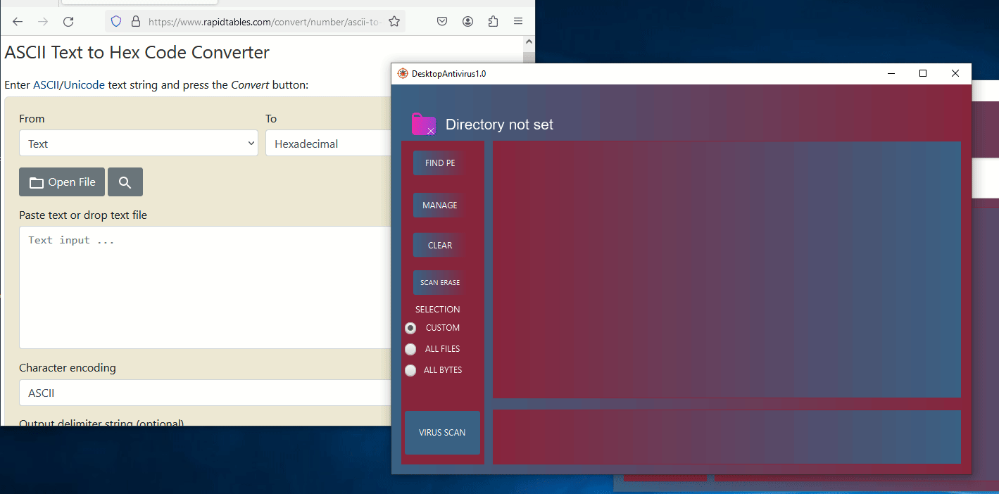

# Plain Antivirus

Experimental prototype of a Java virus scanner. Developed for a Windows platform, recursively scans directories, detects Portable Executable files (PEs), and scans them for malicious byte sequences. Byte sequences are inputted in a hexadecimal form. Has a database connectivity capabilities to import/export byte sequences. 

## Installation
    
HOW TO USE ANTIVIRUS:
1. Start the .exe or .jar in out/artifacts directory (with JRE 1.8+ installed)
2. To set the directory to be scanned, click a folder icon. The program only works with Portable Executables
abt PE : https://ru.wikipedia.org/wiki/Portable_Executable
3. Once the directory is set, click FIND PE to find Portable Executables
TIP: PE scanning is recursive, so all nested directories will be scanned too
4. Once the upper scrollbar is populated with found PEs, the PE search is over
5. To detect the viruses in found PEs, you need to manage monitoring byte sequences. Click MANAGE
6. The opened window is Byte Manager. Here you set, load and export malicious byte sequences
 - 6.1. Setting database is not necessary, you can use local session byte sequences
     - 6.1.1. WITHOUT DATABASE
	     - 6.1.1.1. To add standalone byte sequence, write a byte sequence to a text area. IMPORTANT: To be parsed correctly: Every byte must be HEX format (for example 2D). 
        Bytes should be separated by any whitespace character: space, tab, etc. (check \s regex) https://ilearn.fife.ac.uk/pluginfile.php/18961/mod_resource/content/1/ASCII%20Table.jpg
	     - 6.1.1.2. To add byte sequence to local session, click ADD
     - 6.1.2. WITH DATABASE. To set database connection, click at Database icon. IMPORTANT: To work with database:
	 	  - 1. Antivirus 1.0 only supports MySQL
		  - 2. !!! TO MAP A TABLE CORRECTLY, USE THIS QUERY !!!
      ```sql
          CREATE TABLE `sequence` (
			    `id` bigint NOT NULL AUTO_INCREMENT,
			    `active` BOOLEAN NOT NULL,
			    `sequence` mediumtext NOT NULL,
			    PRIMARY KEY (`id`)
			    );
      ```
      
      TIP: You can set any table name, not only 'sequence'. Once you click at Database icon, enter connection data, for example:

     ```
           DB URL        127.0.0.2
		       Port          3306
		       DB Name       my_db
		       Table name    byte_sequence
		       User login    user
		       User password *****
     ```
      Once the data is set and VALID, click ESTABLISH CONNECTION. If no errors occured, the Connection window is closed, database url set at Byte Manager.
      Now you have database sync, and you can load/export byte sequences.
      TO LOAD BYTE SEQUENCES FROM DATABASE, click PULL.
      TO EXPORT LOCAL SESSION SEQUENCES TO DATABASE, click PUSH
 - 6.2. To clear all added local session byte sequences, click CLEAR
	TIP: CLEAR does not breaks database connection
 - 6.3. If all byte sequences are set, you can finish managing and come back to main window
     - 6.3.1. First, select all byte sequences that are need to be used by clicking a checkbox near it
     - 6.3.2. Once all sequences are selected, click SUBMIT
  - 6.4. Byte manager window will be closed and selected byte sequences will be populated at main screen down scrollpane.
7. To do virus scan, you need to select byte sequences and files to be scanned. Every file will be scanned with every virus byte sequence.
 - 7.1. You can manually select all files and sequences by setting checkboxes checked
 - 7.2. If you want all files to be checked, click ALL FILES radio button
 - 7.3. If you want all byte sequences to be checked, click ALL BYTES radio button
8. ! To start virus scan, click VIRUS SCAN !
9. Once the virus scan is finished, found virus files will be highlighted RED and set with appropriate icon. If no files are highlighted, no viruses were found
10. If you click at the TEXT OF DETECTED VIRUS FILE, virus window will be opened
   - 10.1. At virus window you can see a file name and malware byte sequence found by antivirus
11. To redo virus scan
   - 11.1. If you want to rescan the same directory, click SCAN ERASE to clear scan results
   - 11.2. If you want to do a new scan with new byte sequences and files, click CLEAR

## Demo


